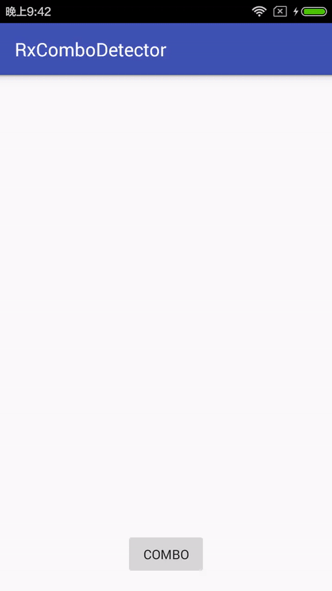

# RxComboDetector
Android view click combo detector with Rx.

## ScreenShot



## Usage
Add to gradle dependency of your module build.gradle:

```gradle
repositories {
    jcenter()
}

dependencies {
    compile 'com.github.piasy:rxcombodetector:1.1.0'
}
```

Use in code:

```java
new RxComboDetector.Builder()
        .detectOn(mBtnCombo)
        .start()
        .observeOn(AndroidSchedulers.mainThread())
        .subscribe(new Consumer<Integer>() {
            @Override
            public void accept(Integer combo) throws Exception {
                mTextView.setText(mTextView.getText() + "Combo x " + combo + "\n");
                mScrollView.fullScroll(View.FOCUS_DOWN);
                mYOLOComboView.combo(combo);
            }
        });
```

See [full example](https://github.com/Piasy/RxComboDetector/tree/master/app) for more details.

## Acknowledgements
+  `ViewClickOnSubscribe` and `Preconditions` classes are grabbed from [RxBinding](https://github.com/JakeWharton/RxBinding), to reduce dependencies of this library.
+  Thanks for [rebound](https://github.com/facebook/rebound) to let me make fancy animation.
+  Thanks for [YOLO](https://www.yoloyolo.tv/), the yellow smiling face.
